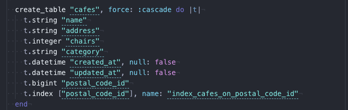

.svg)

### Welcome to the take home portion of your interview! We're excited to jam through some technical stuff with you, but first it'll help to get a sense of how you work through data and coding problems. Work through what you can independently, but do feel free to reach out if you have blocking questions or problems.

1) This requires Postgres (9.4+) & Rails(4.2+), so if you don't already have both installed, please install them.

2) Download the data file from: https://github.com/gospotcheck/ps-code-challenge/blob/master/Street%20Cafes%202015-16.csv

3) Add a varchar column to the table called `category`.   
    
  [Schema Link](https://github.com/nergdnvlt/postcode-fun/blob/master/db/schema.rb)  

4) Create a view with the following columns[provide the view SQL]
  - post_code: The Post Code
  - total_places: The number of places in that Post Code
  - total_chairs: The total number of chairs in that Post Code
  - chairs_pct: Out of all the chairs at all the Post Codes, what percentage does this Post Code represent (should sum to 100% in the whole view)
  - place_with_max_chairs: The name of the place with the most chairs in that Post Code
  - max_chairs: The number of chairs at the place_with_max_chairs

  [View Code](https://github.com/nergdnvlt/postcode-fun/blob/master/app/views/postal_codes/index.html.erb)  

  [Deployed Postal Code Page](https://postcode-fun.herokuapp.com/postal_codes)  

  [Testing](https://github.com/nergdnvlt/postcode-fun/blob/master/spec/features/postal_codes/user_can_view_index_spec.rb)

  Testing Description:  
    `I used both unit level testing and feature level testing to ensure the results. I also calculated the total sum of all percentages to make sure that it was 100% and displayed that to the page.`

5) Write a Rails script to categorize the cafes and write the result to the category according to the rules:[provide the script]  
    - If the Post Code is of the LS1 prefix type:  
        - `# of chairs less than 10: category = 'ls1 small'` 
        - `# of chairs greater than or equal to 10, less than 100: category = 'ls1 medium'` 
        - `# of chairs greater than or equal to 100: category = 'ls1 large' ` 
    - If the Post Code is of the LS2 prefix type: 
        - `# of chairs below the 50th percentile for ls2: category = 'ls2 small'` 
        - `# of chairs above the 50th percentile for ls2: category = 'ls2 large'` 
    - For Post Code is something else: 
      - `category = 'other'` 

  [Testing](https://github.com/nergdnvlt/postcode-fun/blob/master/spec/models/postal_code_spec.rb)   
  `A note on testing this: I was having a strange issue with my database rolling back the changes in test. I verified that the right changes were happening both through the use of prod and then in my local dev environment. But for now I'm looking into whether or not database cleaner is rolling back my db changes between the controller and the view.`  
  
   
  
6) Write a custom view to aggregate the categories [provide view SQL AND the results of this view]
    - category: The category column
    - total_places: The number of places in that category
    - total_chairs: The total chairs in that category 
     
[View Code](https://github.com/nergdnvlt/postcode-fun/blob/master/app/views/pages/categories.html.erb)  

[Deployed Categories Page](https://postcode-fun.herokuapp.com/categories)  

 

7) Write a script in rails to:
    - For street_cafes categorized as small, write a script that exports their data to a csv and deletes the records
    - For street cafes categorized as medium or large, write a script that concatenates the category name to the beginning of the name and writes it back to the name column

[Code for Small](https://github.com/nergdnvlt/postcode-fun/blob/master/app/services/small_category_service.rb)  
[Code for Large](https://github.com/nergdnvlt/postcode-fun/blob/master/spec/features/pages/user_can_alter_medium_large_spec.rb)  

[Deployed page for both button scripts](https://postcode-fun.herokuapp.com/)  

[Testing for Small](https://github.com/nergdnvlt/postcode-fun/blob/master/spec/features/pages/user_can_print_csv_spec.rb)
[Testing for Small](https://github.com/nergdnvlt/postcode-fun/blob/master/spec/features/pages/user_can_alter_medium_large_spec.rb)

8) Show your work and check your email for submission instructions.

9) Celebrate, you did great!
